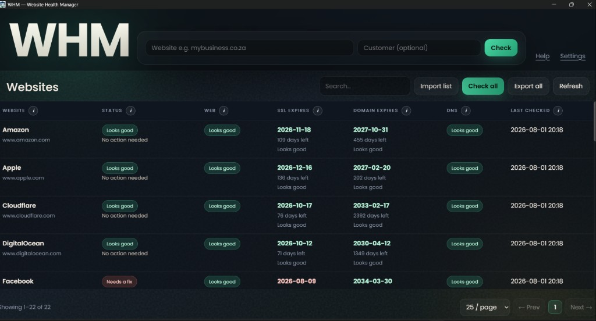
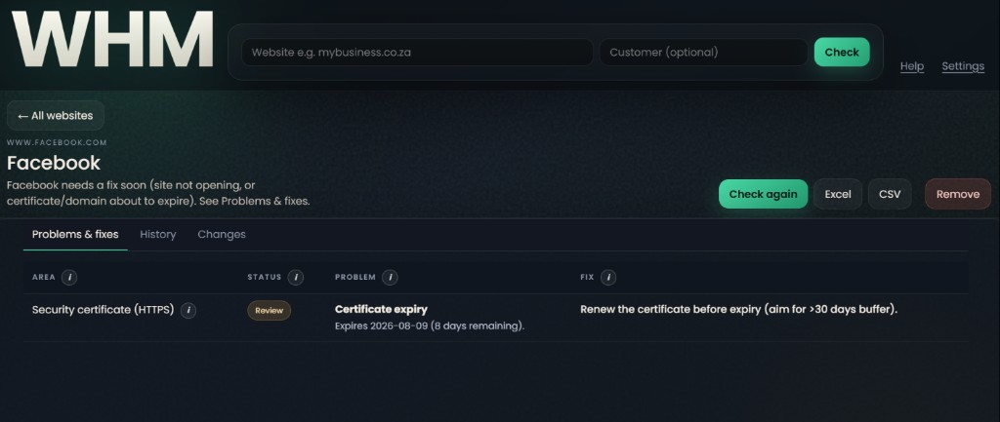
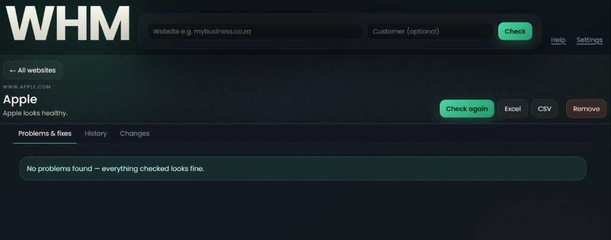
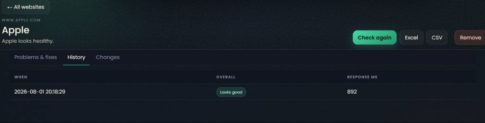
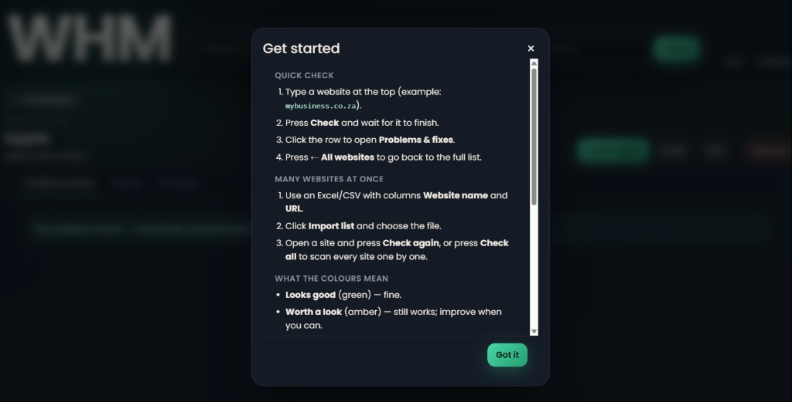
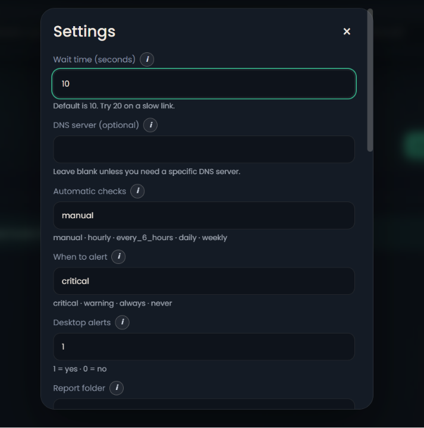
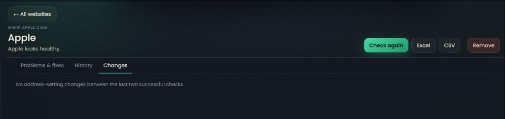

<p align="center">
  
</p>

# Website Health Manager (WHM)

**Setup guide** — install once, then check websites in plain English.

Paste a site (or import a list), press **Check**, and see whether the website opens, when the certificate and domain expire, and whether DNS looks right. No Python install for end users.

---

## App preview

<p align="center">
  
  <br />
  <em>Websites list — status at a glance, expiry dates, search, import/export, pagination</em>
</p>

<p align="center">
  
  <br />
  <em>Problems &amp; fixes — what is wrong and what to do next</em>
</p>

| Healthy site | History |
|:---:|:---:|
|  |  |

| Get started help | Settings |
|:---:|:---:|
|  |  |

<p align="center">
  
  <br />
  <em>Changes — DNS address settings that moved between checks</em>
</p>

---

## Install on Windows (setup)

### Recommended install

1. Download **[WebsiteHealthManager-Setup-0.1.3.exe](https://github.com/Pieter1821/Website-Health-Manager/releases/download/v0.1.3/WebsiteHealthManager-Setup-0.1.3.exe)** from the [latest release](https://github.com/Pieter1821/Website-Health-Manager/releases/latest).
2. Double-click the setup → **Next** → **Install**.
3. Open **Website Health Manager** from the Start menu or desktop shortcut.
4. Chrome opens the WHM window.
5. Type a website (example: `mybusiness.co.za`) → **Check**.
6. Click a row → **Problems & fixes**. Export with **Excel** / **CSV**, or **Export all** for every site (saved to Downloads).

No Python is required. By default your data stays on this PC under `%USERPROFILE%\.whm\`. Optional shared cloud storage (Cloudflare D1) is documented in [`docs/cloudflare-d1.md`](docs/cloudflare-d1.md).

Windows may show SmartScreen for an unsigned build — choose **More info** → **Run anyway**.

### First-time walkthrough

1. Type a website at the top → press **Check**.
2. Click the row to open **Problems & fixes**.
3. Press **← All websites** to return to the list.
4. For many sites: use Excel/CSV with columns **Website name** and **URL** → **Import list** → **Check all**.

Template: [`examples/websites-import-template.csv`](examples/websites-import-template.csv)

Full URLs work (`https://www.example.com`) and so do bare domains (`example.com`).

---

## What the colours mean

| Status | Meaning |
|--------|---------|
| **Looks good** (green) | Fine — no action needed |
| **Worth a look** (amber) | Still works; improve when you can |
| **Needs a fix** (red) | Fix soon — site not opening, or certificate/domain about to expire |
| **Couldn’t finish** (grey) | Check didn’t complete — try again |

---

## What it checks

| Area | Meaning |
|------|---------|
| **Web** | Does the site open in a browser? |
| **SSL** | Certificate date and hostname match |
| **Domain** | Registration / expiry |
| **DNS** | Address records and changes between checks |

Security-header and speed checks are off on purpose (they add noise).

---

## Day-to-day tips

- Use **Search** and the page controls under the list when you have many websites.
- **Check again** refreshes one site; **Check all** walks through the full list.
- **Help** (top right) opens the same get-started guide as above.
- **Settings** — wait time, automatic re-checks, and optional alerts (desktop / Slack / Teams). Hover each **i** for a short explanation.

---

## Build the setup yourself (IT / developers)

```powershell
cd path\to\Website-Health-Manager
.\.venv\Scripts\Activate.ps1   # or: python -m venv .venv && .\.venv\Scripts\Activate.ps1
pip install -e ".[dev]" pyinstaller
# Optional: install Inno Setup 6 from https://jrsoftware.org/isinfo.php
.\packaging\build-setup.ps1
```

| Output | Use |
|--------|-----|
| `dist\WebsiteHealthManager.exe` | Portable — copy and double-click |
| `dist\WebsiteHealthManager-Setup-*.exe` | Installer — Start menu + desktop shortcut |

### Run from source (developers)

```powershell
pip install -e ".[dev]"
python -m whm
```

Leave the terminal open; stop with `Ctrl+C`. Tk fallback: `python -m whm --tk`.

The app can check GitHub Releases for a newer installer (**Updates** in the top bar, and a quiet check shortly after launch).

### Tests

```powershell
pytest -q
```

### Shared cloud database (optional)

The app stays a **desktop** install. Cloudflare D1 is only private remote storage the desktop app talks to over HTTPS — not a website. See **[`docs/cloudflare-d1.md`](docs/cloudflare-d1.md)**.

```powershell
python -m whm.migrate_to_cloud --api-url https://whm-api.xxx.workers.dev --token YOUR_TOKEN --yes --save-config
python -m whm
```

---

## License

MIT — see [`LICENSE`](LICENSE).
