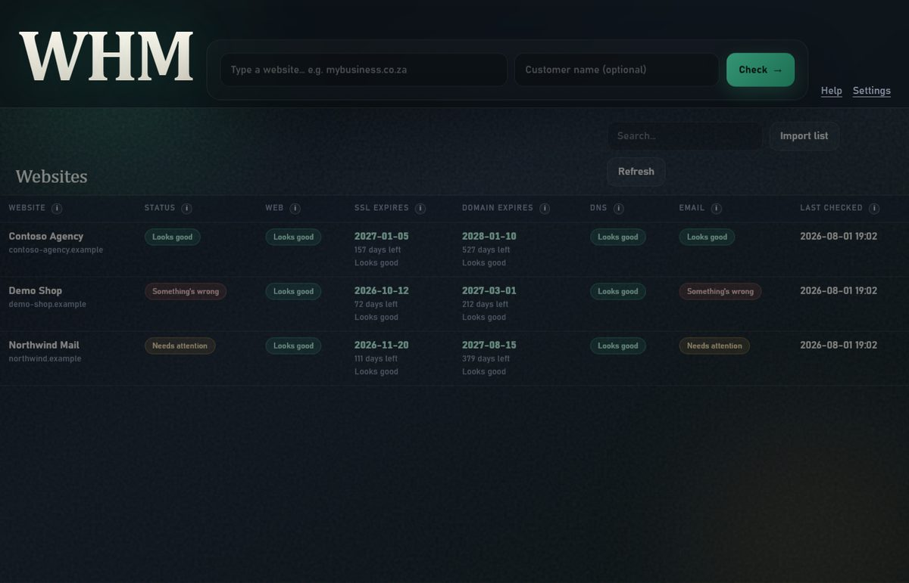

<p align="center">
  
</p>

# Website Health Manager (WHM)

Desktop tool for agencies and IT support: paste a customer website, press **Check**, and see why the site, domain, certificate, DNS, or email (especially SendGrid) is broken — in plain language.

<p align="center">
  
</p>

## Get started (manual)

### Option A — use the `.exe` (easiest)

1. Open `dist\WebsiteHealthManager.exe` (double-click).
2. Chrome opens the WHM window.
3. Type a customer domain (example: `mybusiness.co.za`) and press **Check**.
4. Wait until the status line finishes (can take under a minute).
5. Click the row → read **Problems & fixes**.
6. Press **Download report** if you need a ZIP for the ticket or customer.
7. Close the Chrome window when done. Open the `.exe` again next time.

In the app, click **Help** any time for this same guide.

### Option B — import many customers

1. Prepare Excel/CSV with columns **Client Website** and **URL** (other columns are ignored).
2. In WHM click **Import list** and pick the file.
3. Select a site → **Check again** (or check new ones from the top bar).

Template: `examples/websites-import-template.csv`

### What the colours mean

| Status | Meaning |
|--------|---------|
| Looks good | No action needed for that area |
| Needs attention | Fix soon (example: certificate renewing soon) |
| Something's wrong | Likely breaking the site or email |
| Couldn't check | Your network/DNS failed the probe — retry, do not escalate yet |

Hover the small **i** on each column for a one-line explanation.

### Common actions

- **Check again** — rescan the open site  
- **Download report** — ZIP with HTML + CSV + JSON on your PC  
- **Remove** — delete the site from your local list  
- **Settings** — timeouts, auto-check schedule, Slack/email alerts  

Your data stays on this PC under `%USERPROFILE%\.whm\`.

## Problem it solves

Customer tickets usually sound like “the website is down” or “mail is in spam”. The real cause is often elsewhere: expired SSL, expired domain, wrong DNS, missing SPF/DKIM/DMARC, or incomplete SendGrid authentication. WHM pulls those checks into one screen so you do not have to jump between registrar, DNS, hosting, and SendGrid.

## What it checks

| Area | Meaning |
|------|---------|
| Web | Does the site open? |
| SSL | Padlock certificate date and hostname match |
| Domain | Registration / expiry |
| DNS | Address records and changes over time |
| Email | SPF, DKIM, DMARC, MX, SendGrid checklist |

Security-header and speed checks are intentionally off — they create noise you usually cannot fix on customer hosting.

## Setup (Windows)

```powershell
cd C:\Users\Pieter\Website-Health-Manager
python -m venv .venv
.\.venv\Scripts\Activate.ps1
pip install -e ".[dev]"
python -m whm
```

Chrome opens in app mode at `http://127.0.0.1:17865/`. Leave the terminal open; stop with `Ctrl+C`.

Tkinter fallback: `python -m whm --tk` or `WHM_UI=tk`.

Data and logs live under `%USERPROFILE%\.whm\` (`whm.db`, `logs\`).

## How it works

1. Type a domain (or **Import list** from Excel/CSV with columns `Client Website` + `URL`).
2. Press **Check** — scan runs in the background.
3. Read the table (hover the **i** icons for plain-English column help).
4. Click a row for **Problems & fixes**, history, and DNS changes.
5. **Download report** saves a ZIP (HTML + CSV + JSON) to your PC.

Architecture: Clean Architecture under `src/whm/` — `domain` → `application` → `infrastructure` → `presentation` (web UI + local API, Tk fallback).

## Import format

Only these columns are used (others ignored):

```csv
Client Website,URL
Demo Shop,https://demo-shop.example
```

Sample list: `examples/test-clients-import.csv`  
Template: `examples/websites-import-template.csv`

## Tests

```powershell
.\.venv\Scripts\Activate.ps1
pytest -q
```

## Deploy as an `.exe` (recommended for staff PCs)

Best path for non-technical users: ship one Windows executable built with **PyInstaller**.

```powershell
cd C:\Users\Pieter\Website-Health-Manager
.\.venv\Scripts\Activate.ps1
pip install pyinstaller
pyinstaller --noconfirm packaging/whm.spec
```

Output (smoke-tested): `dist\WebsiteHealthManager.exe` (~21 MB)

- Double-click runs Chrome app mode + local API at `http://127.0.0.1:17865/`.
- No Python install required on the target PC.
- Still needs internet for live checks (DNS/HTTP/WHOIS).
- First-run data still goes to `%USERPROFILE%\.whm\`.
- Copy only that `.exe` to a shared folder or USB for support staff.

**Why not a website in the cloud?** This tool probes customer domains and email DNS from *your* network and keeps results local. A public SaaS would need auth, multi-tenant storage, and outbound scan workers — useful later, heavier now.

**Why not Microsoft Store / MSIX yet?** Fine later for distribution polish; PyInstaller `.exe` (or an Inno Setup installer wrapping it) is the fastest way to get this onto support desks.

Optional next packaging steps: code-signing the exe, Inno Setup installer, auto-update.

## License

MIT — see `LICENSE`.
